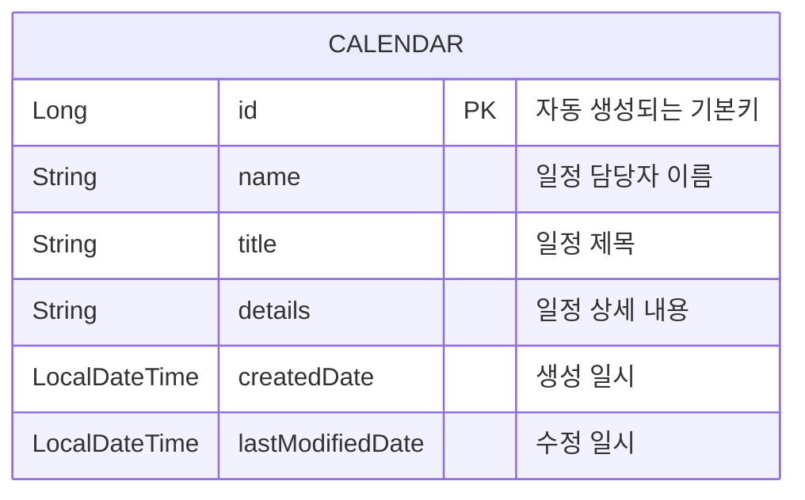

# Calendar API 프로젝트

<details>
<summary>Level 1 - Calendar API</summary>

## 프로젝트 소개
이 프로젝트는 일정 관리를 위한 기본적인 CRUD(Create, Read, Update, Delete) 기능을 제공하는 REST API입니다.

## 기술 스택
- Java 17
- Spring Boot 3.4.0
- Spring Data JPA
- H2 Database
- Lombok
- Gradle

## ERD (Entity Relationship Diagram)



## API 엔드포인트

### 1. 일정 생성
- **POST** `/calendar`
- Request Body:
  ```json
  {
      "name": "일정 이름",
      "title": "일정 제목",
      "details": "일정 상세내용"
  }


### 2. 일정 조회
- 단일 조회: **GET** `/calendar/{id}`
- 전체 조회: **GET** `/calendar/all`

### 3. 일정 수정
- **PATCH** `/calendar/{id}`
- Request Body:
  ```json
  {
      "name": "수정된 이름",
      "title": "수정된 제목",
      "details": "수정된 상세내용"
  }
  ```

### 4. 일정 삭제
- **DELETE** `/calendar/{id}`

## 주요 기능
- 일정 데이터의 생성 시간(`createdDate`)과 수정 시간(`lastModifiedDate`) 자동 기록
- JPA Auditing을 통한 시간 정보 자동 관리
- DTO 패턴을 통한 데이터 전송 계층 분리

## 프로젝트 구조
src/main/java/com/example/demo/lv1/
├── controller
│ └── CalendarController.java
├── service
│ ├── ServiceCalendar.java
│ └── CalendarService.java
├── repository
│ └── CalendarRepository.java
├── entity
│ └── CalendarEntity.java
└── dto
├── RequestCalendarDto.java
└── ResponseCalendarDto.java

## 데이터베이스 설정
H2 인메모리 데이터베이스를 사용하며, 다음 설정으로 접근 가능합니다:
- URL: `jdbc:h2:mem:testdb`
- Username: `sa`
- Password: (빈 값)
- H2 콘솔: `http://localhost:8080/h2-console`

## 빌드 및 실행 방법

bash
프로젝트 빌드
./gradlew build
애플리케이션 실행
./gradlew bootRun

## 참고사항
- 애플리케이션 실행 시 자동으로 테이블이 생성됩니다
- 인메모리 데이터베이스를 사용하므로 애플리케이션 재시작 시 데이터가 초기화됩니다

</details>