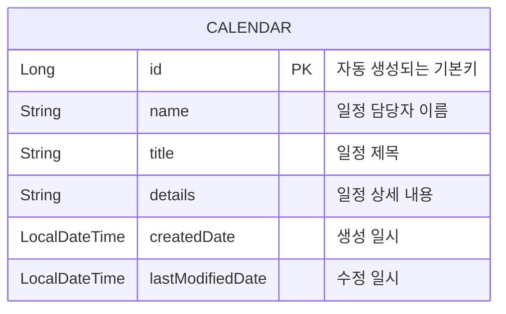
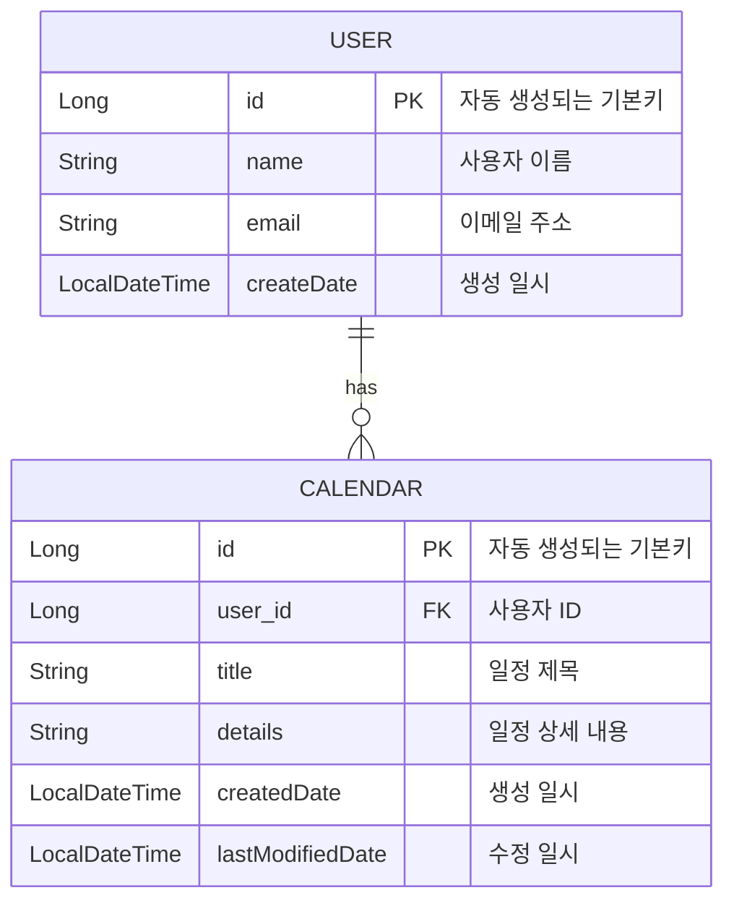

# Calendar API 프로젝트

<details>
<summary>Level 1 - Calendar API</summary>

## 프로젝트 소개
이 프로젝트는 일정 관리를 위한 기본적인 CRUD(Create, Read, Update, Delete) 기능을 제공하는 REST API입니다.

## 기술 스택
- Java 17
- Spring Boot 3.4.0
- Spring Data JPA
- H2 Database
- Lombok
- Gradle

## ERD (Entity Relationship Diagram)



## API 엔드포인트

### 1. 일정 생성
- **POST** `/calendar`
- Request Body:
  ```json
  {
      "name": "일정 이름",
      "title": "일정 제목",
      "details": "일정 상세내용"
  }


### 2. 일정 조회
- 단일 조회: **GET** `/calendar/{id}`
- 전체 조회: **GET** `/calendar/all`

### 3. 일정 수정
- **PATCH** `/calendar/{id}`
- Request Body:
  ```json
  {
      "name": "수정된 이름",
      "title": "수정된 제목",
      "details": "수정된 상세내용"
  }
  ```

### 4. 일정 삭제
- **DELETE** `/calendar/{id}`

## 주요 기능
- 일정 데이터의 생성 시간(`createdDate`)과 수정 시간(`lastModifiedDate`) 자동 기록
- JPA Auditing을 통한 시간 정보 자동 관리
- DTO 패턴을 통한 데이터 전송 계층 분리

## 프로젝트 구조
src/main/java/com/example/demo/lv1/
├── controller
│ └── CalendarController.java
├── service
│ ├── ServiceCalendar.java
│ └── CalendarService.java
├── repository
│ └── CalendarRepository.java
├── entity
│ └── CalendarEntity.java
└── dto
├── RequestCalendarDto.java
└── ResponseCalendarDto.java

## 데이터베이스 설정
H2 인메모리 데이터베이스를 사용하며, 다음 설정으로 접근 가능합니다:
- URL: `jdbc:h2:mem:testdb`
- Username: `sa`
- Password: (빈 값)
- H2 콘솔: `http://localhost:8080/h2-console`

## 빌드 및 실행 방법

bash
프로젝트 빌드
./gradlew build
애플리케이션 실행
./gradlew bootRun

## 참고사항
- 애플리케이션 실행 시 자동으로 테이블이 생성됩니다
- 인메모리 데이터베이스를 사용하므로 애플리케이션 재시작 시 데이터가 초기화됩니다

</details>

<details>
<summary>Level 2 - Calendar API with User Entity</summary>

## 프로젝트 소개
이 프로젝트는 Level 1의 기능을 확장하여 사용자(User) 엔티티를 추가하고, 사용자와 일정 간의 관계를 구현한 REST API입니다.

## 기술 스택
- Java 17
- Spring Boot 3.4.0
- Spring Data JPA
- H2 Database
- Lombok
- Gradle
- Jakarta Validation

## ERD (Entity Relationship Diagram)



## API 엔드포인트

### 1. 사용자 관리
- **POST** `/user`
  - 사용자 생성
  ```json
  {
      "name": "사용자 이름",
      "email": "user@example.com"
  }
  ```
- **GET** `/user/{name}`
  - 사용자 ID 조회

### 2. 일정 관리
- **POST** `/calendar/user/{id}`
  - 특정 사용자의 일정 생성
  ```json
  {
      "title": "일정 제목",
      "details": "일정 상세내용"
  }
  ```
- **GET** `/calendar/user/{id}`
  - 특정 사용자의 모든 일정 조회
- **GET** `/calendar/all`
  - 전체 일정 조회
- **PATCH** `/calendar`
  - 일정 수정
  ```json
  {
      "requestCalendarDto": {
          "title": "수정할 일정 제목",
          "details": "현재 상세내용"
      },
      "newDetails": "변경할 상세내용"
  }
  ```
- **DELETE** `/calendar/user/{id}`
  - 특정 사용자의 일정 삭제

## 주요 기능
- 이메일 유효성 검사 (`@Email` 어노테이션 사용)
- JPA를 활용한 사용자-일정 간 일대다 관계 구현
- 일정 데이터의 생성 시간과 수정 시간 자동 기록
- DTO 패턴을 통한 계층 분리

## 프로젝트 구조

src/main/java/com/example/demo/lv2/
├── controller
│ ├── UserController.java
│ └── CalendarController.java
├── service
│ ├── UserService.java
│ ├── UserCoreService.java
│ ├── ServiceCalendar.java
│ └── CalendarService.java
├── repository
│ ├── UserRepository.java
│ └── CalendarRepository.java
├── entity
│ ├── UserEntity.java
│ └── CalendarEntity.java
└── dto
├── RequestUserDto.java
├── ResponseUserDto.java
├── RequestCalendarDto.java
├── ResponseCalendarDto.java
└── PatchRequestCalendarDto.java

## 데이터베이스 설정
H2 인메모리 데이터베이스를 사용하며, 다음 설정으로 접근 가능합니다:
- URL: `jdbc:h2:mem:testdb`
- Username: `sa`
- Password: (빈 값)
- H2 콘솔: `http://localhost:8080/h2-console`

## 참고사항
- 애플리케이션 실행 시 자동으로 테이블이 생성됩니다
- 인메모리 데이터베이스를 사용하므로 애플리케이션 재시작 시 데이터가 초기화됩니다
- Level 1과 달리 사용자 엔티티가 추가되어 일정 관리에 사용자 개념이 도입되었습니다

</details>